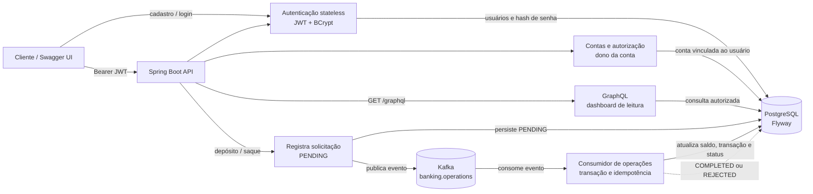

# Banking Demo

Demo bancário em Java 17 e Spring Boot com autenticação JWT stateless, uma conta por usuário e processamento assíncrono de depósitos e saques via Kafka.

## O que este demo mostra

| Área | Demonstração |
| --- | --- |
| Identidade | Cadastro, login stateless, senha BCrypt e JWT Bearer. |
| Autorização | A conta pertence a um único usuário e toda rota protegida confere a propriedade pelo token. |
| Operações | Depósito e saque com regras de conta ativa, valor positivo e saldo suficiente. |
| Assincronia | A API persiste `PENDING`, devolve `202 Accepted` e delega o processamento ao Kafka. |
| Consistência | Consumidor transacional, histórico de movimentações, versionamento otimista e reentrega idempotente. |
| Leitura | REST para recurso individual e GraphQL para o dashboard da conta com históricos recentes. |
| Documentação | Swagger UI/OpenAPI com exemplos dos campos de cadastro, login e Bearer token. |
| Ambiente | Flyway, Docker Compose, healthchecks e testes com PostgreSQL/Kafka reais em Testcontainers. |

Todos os identificadores gerados pela aplicação são UUIDv7. O vínculo da conta é extraído do token; nenhum endpoint aceita `holderId` ou `userId` no corpo.

## Configuração

As configurações da aplicação ficam em [application.yml](src/main/resources/application.yml) e são agrupadas em `AppProperties`: nome, JWT, tópico Kafka e metadados OpenAPI. O segredo JWT pode ser definido sem alterar arquivos pelo ambiente:

```bash
export APP_JWT_SECRET='uma-chave-longa-e-aleatoria-para-o-ambiente'
```

Os demais valores também podem ser sobrescritos por variáveis de ambiente:

| Variável | Propriedade | Uso |
| --- | --- | --- |
| `APP_JWT_SECRET` | `app.security.jwt-secret` | Chave de assinatura do JWT. Obrigatória fora do ambiente de demonstração. |
| `APP_SECURITY_JWT_EXPIRATION_SECONDS` | `app.security.jwt-expiration-seconds` | Validade do token em segundos. |
| `APP_KAFKA_OPERATIONS_TOPIC` | `app.kafka.operations-topic` | Nome do tópico de movimentações. |
| `APP_KAFKA_CONSUMER_GROUP_ID` | `app.kafka.consumer-group-id` | Grupo do consumidor Kafka. |

Os valores de partições, réplicas e informações da especificação OpenAPI também estão no YAML. Consulte [AppProperties](src/main/java/com/showcase/banking/config/AppProperties.java) para a lista tipada e validada.

## Stack e dependências

| Área | Tecnologias |
| --- | --- |
| Linguagem e framework | Java 17, Spring Boot, Gradle |
| API | Spring Web MVC, Spring Validation, Spring Security, Spring for GraphQL, springdoc-openapi |
| Persistência | Spring Data JDBC, PostgreSQL, Flyway |
| Mensageria | Spring for Apache Kafka |
| Desenvolvimento local | Spring Boot DevTools e suporte a Docker Compose |
| Testes | JUnit 5, Spring Boot Test e Testcontainers (PostgreSQL e Kafka) |
| Produtividade | Lombok |

## Pré-requisitos

- JDK 17.
- Docker em execução para subir os serviços locais e executar os testes de integração.
- `make` (opcional; os comandos Gradle também podem ser usados diretamente).

## Como executar localmente

```bash
# Mostra os comandos disponíveis
make help

# Inicia PostgreSQL e Kafka e espera ambos ficarem saudáveis
make infra-up

# Exibe o estado ou acompanha os logs da infraestrutura
make infra-status
make infra-logs

# Executa a API; Flyway aplica as migrations automaticamente
make run

# Executa os testes, incluindo os que usam Testcontainers
make test
```

O [compose.yaml](compose.yaml) disponibiliza PostgreSQL e Kafka para desenvolvimento; os dois containers têm healthchecks. Para a suíte de integração, a configuração de teste sobe containers isolados via Testcontainers, portanto os serviços locais não são necessários para `make test`.

Também é possível usar o Gradle Wrapper diretamente:

```bash
./gradlew bootRun
./gradlew test
```

## Endpoints e documentação

Com a aplicação em execução, a especificação OpenAPI e a interface interativa das rotas REST estão disponíveis em:

- [Swagger UI](http://localhost:8080/swagger-ui/index.html)
- [OpenAPI JSON](http://localhost:8080/v3/api-docs)
- [GraphiQL](http://localhost:8080/graphiql) para explorar e executar as consultas GraphQL.

Acessar [http://localhost:8080](http://localhost:8080) redireciona para o Swagger UI.

| Método | Rota | Protegida | Resposta | Finalidade |
|:---|:---|:---|:---|:---|
| `POST` | `/auth/register` | Não | `201 Created` | Cria um usuário e devolve JWT; não cria conta automaticamente. |
| `POST` | `/auth/login` | Não | `200 OK` | Aceita e-mail e senha; devolve JWT, `accountId` (ou `null`) e `canCreateAccount`. |
| `POST` | `/accounts` | Sim | `201 Created` | Cria a única conta do usuário autenticado. Corpo vazio. |
| `GET` | `/accounts/{accountId}` | Sim | `200 OK` | Consulta a conta, somente se pertencer ao token. |
| `POST` | `/accounts/{accountId}/deposits` | Sim | `202 Accepted` | Solicita depósito na própria conta. |
| `POST` | `/accounts/{accountId}/withdrawals` | Sim | `202 Accepted` | Solicita saque na própria conta. |
| `GET` | `/requests/{requestId}` | Sim | `200 OK` | Consulta solicitação da própria conta. |
| `POST` | `/graphql` | Sim | `200 OK` | Executa o dashboard composto da própria conta. |

As rotas REST acima constam no Swagger/OpenAPI (`/swagger-ui/index.html` e `/v3/api-docs`). A rota `/graphql` possui schema próprio e não é exibida no Swagger; consulte o exemplo abaixo ou envie consultas para esse endpoint.

### Fluxo no Swagger

1. Execute `POST /auth/register` ou `POST /auth/login`. Ambos têm um exemplo de JSON editável diretamente no Swagger.
2. Copie `accessToken`, clique em **Authorize** e cole somente o token (ou `Bearer <token>`).
3. Se a resposta trouxer `accountId: null` e `canCreateAccount: true`, execute `POST /accounts` sem corpo uma única vez.
4. Use o `accountId` retornado nas chamadas de consulta, depósito e saque. A API retorna `403` para uma conta ou solicitação de outro usuário, `401` para token ausente/inválido e `409` se tentar criar outra conta.

Os schemas OpenAPI descrevem cada campo: `accessToken` é o Bearer JWT, `accountId` é a conta opcional no login, `canCreateAccount` indica a próxima ação possível, e `requestId` identifica uma operação assíncrona. Senhas nunca retornam na resposta nem são persistidas em texto puro.

| Situação | Resposta esperada |
| --- | --- |
| Token inválido ou expirado | `401 Unauthorized` |
| Conta ou solicitação de outro usuário | `403 Forbidden` |
| Conta ou solicitação inexistente | `404 Not Found` |
| Segunda tentativa de criar conta, ou e-mail já cadastrado | `409 Conflict` |
| Operação aceita para processamento | `202 Accepted` com status `PENDING` |

### Consulta GraphQL para a tela de conta

O GraphQL é usado como uma API de leitura composta: uma tela pode buscar a conta, as dez movimentações mais recentes e as dez últimas solicitações em uma única consulta. Os comandos permanecem em REST para preservar o contrato assíncrono `202 Accepted`.
Valores monetários são retornados como `String`, evitando perda de precisão por ponto flutuante no cliente.

| Campo | Tipo | Significado |
| --- | --- | --- |
| `account` | `Account` | Conta autorizada, com UUIDv7, status e saldo. |
| `recentTransactions` | lista de até 10 itens | Movimentações efetivadas, incluindo saldo após cada uma. |
| `recentRequests` | lista de até 10 itens | Intenções assíncronas, inclusive `PENDING` e motivos de rejeição. |

`accountOverview` também valida a propriedade da conta pelo JWT. Assim, GraphQL segue o mesmo modelo de autorização das rotas REST.

Com a aplicação em execução, envie a consulta para `POST /graphql`:

```graphql
query AccountDashboard($accountId: ID!) {
  accountOverview(accountId: $accountId) {
    account { id status balance }
    recentTransactions { id operationType amount balanceAfter createdAt }
    recentRequests { id operationType amount status processedAt rejectionReason }
  }
}
```

Variáveis:

```json
{ "accountId": "the-account-id-returned-by-POST-accounts" }
```

Substitua o valor inteiro pelo UUID retornado ao criar a conta; não envie literalmente `{accountId}`.

O endpoint aceita o envelope usual do GraphQL, por exemplo:

```bash
ACCOUNT_ID='cole-aqui-o-UUID-retornado-por-POST-accounts'

curl -X POST http://localhost:8080/graphql \
  -H 'Content-Type: application/json' \
  -H 'Authorization: Bearer {accessToken}' \
  -d "{\"query\":\"query(\$accountId: ID!) { accountOverview(accountId: \$accountId) { account { balance } recentTransactions { amount } } }\",\"variables\":{\"accountId\":\"${ACCOUNT_ID}\"}}"
```

Exemplo de fluxo completo:

```bash
# Cadastre o usuário, copie accessToken e informe-o no cabeçalho das chamadas seguintes.
curl -X POST http://localhost:8080/auth/register \
  -H 'Content-Type: application/json' \
  -d '{"email":"ana@example.com","password":"senha-segura-123"}'

# Crie a única conta desse usuário; guarde o id retornado em accountId.
curl -X POST http://localhost:8080/accounts \
  -H 'Authorization: Bearer {accessToken}'

# Solicite um depósito; guarde o requestId retornado.
curl -X POST http://localhost:8080/accounts/{accountId}/deposits \
  -H 'Content-Type: application/json' \
  -H 'Authorization: Bearer {accessToken}' \
  -d '{"amount":125.50}'

# Consulte o resultado assíncrono.
curl -H 'Authorization: Bearer {accessToken}' http://localhost:8080/requests/{requestId}
curl -H 'Authorization: Bearer {accessToken}' http://localhost:8080/accounts/{accountId}
```

## Arquitetura



### Como o fluxo funciona

1. O cliente cria usuário ou faz login. A API valida a senha BCrypt e devolve um JWT; o token contém o identificador do usuário, não o `accountId`.
2. Nas rotas protegidas, o filtro JWT autentica o usuário. Antes de consultar ou movimentar uma conta, a API confere se aquela conta pertence ao usuário do token.
3. Depósito e saque são assíncronos: a API persiste uma `banking_request` como `PENDING`, responde `202 Accepted` com `requestId` e publica o evento no Kafka.
4. O consumidor lê o evento, executa as regras na mesma transação do PostgreSQL, grava a movimentação e muda a solicitação para `COMPLETED` ou `REJECTED`.
5. Entregas repetidas são seguras: uma solicitação já finalizada não altera o saldo novamente.

| Integração | Responsabilidade |
| --- | --- |
| Swagger/OpenAPI | Explorar a API, enviar credenciais e informar o Bearer token. |
| PostgreSQL + Flyway | Persistir usuários, conta, solicitações e movimentações com schema versionado. |
| Kafka | Desacoplar o recebimento HTTP do processamento financeiro. A chave é o `accountId`, preservando a ordem por conta. |
| GraphQL | Buscar o dashboard da própria conta e históricos recentes em uma única consulta. |

## Regras e garantias do domínio

| Regra | Onde é garantida |
| --- | --- |
| Um e-mail representa um único usuário | Índice único de `app_user.email` e validação no serviço de autenticação. |
| Um usuário tem no máximo uma conta | Restrição única em `account.user_id` e validação antes da criação. |
| O cliente só vê a própria conta e solicitações | `AccountAccess` compara o usuário do JWT com o dono da conta. |
| IDs são ordenáveis no tempo | Gerador UUIDv7 aplicado a usuário, conta, solicitação e transação. |
| Não existe saldo negativo | Regras de domínio e `CHECK` constraints no PostgreSQL. |
| Uma operação não é aplicada duas vezes | Solicitações finalizadas são ignoradas pelo consumidor Kafka. |
| Saldo e transação mudam juntos | Processamento do consumidor executa dentro de transação. |

## Logs para demonstração

O nível padrão (`INFO`) registra os marcos necessários para acompanhar uma operação pelos campos `requestId` e `accountId`: criação da conta, solicitação da operação, publicação e consumo do evento, conclusão, rejeição e reentrega idempotente. Falhas de publicação são registradas como `ERROR` com a exceção.

Para acompanhar o fluxo localmente, execute `make run` e observe a saída da aplicação. A suíte de integração também gera esses logs enquanto valida depósito, saque sem saldo e idempotência.

## Testes

```bash
# Todas as verificações, incluindo PostgreSQL e Kafka reais em containers
make test

# Apenas compilação e verificações Gradle
make verify
```

A suíte cobre regras de crédito e débito, UUIDv7, assinatura/validação de JWT, depósito publicado e processado pelo Kafka, saque sem saldo e reentrega idempotente do mesmo evento. O relatório HTML é gerado em `build/reports/tests/test/index.html`.

## Estrutura

```text
src/main/java/.../auth/           cadastro, login e persistência do usuário
src/main/java/.../account/        conta, autorização e dashboard GraphQL
src/main/java/.../operation/      requests, Kafka, consumidor e transações
src/main/java/.../security/       filtro JWT e configuração stateless
src/main/java/.../config/         AppProperties, OpenAPI e infraestrutura
src/main/resources/application.yml configuração tipada e sobrescrita por ambiente
src/main/resources/db/migration/  schema versionado pelo Flyway
src/main/resources/graphql/       schema da consulta GraphQL
src/test/                         testes unitários e integração Testcontainers
docs/requirements.md              requisitos funcionais e técnicos do demo
compose.yaml                      PostgreSQL e Kafka para desenvolvimento local
Makefile                          atalhos de desenvolvimento
```
